<!--Start Page personalizada-->

<h3> 

Duck home
</h3>

Duck home tem como finalidade ser leve, agradável, funcional e o centro durante o uso do navegador com suas funcionalidades.

---

&nbsp;

### Preview

<table>
  <tr>
    <th>Tela de descanso</th>
    <th>Marcadores</th>
  </tr>
  <tr>
    <th>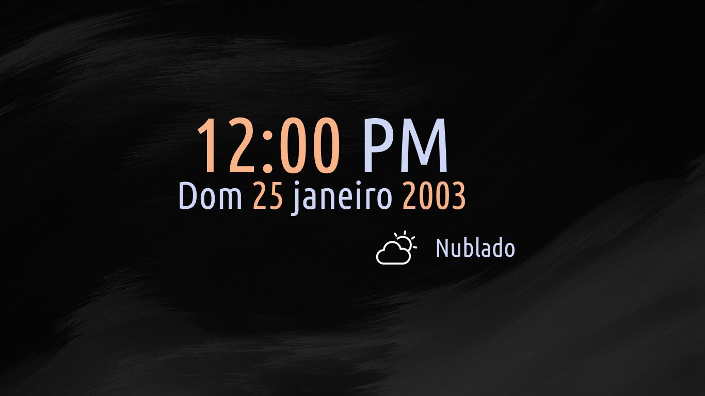</img></th>
    <th>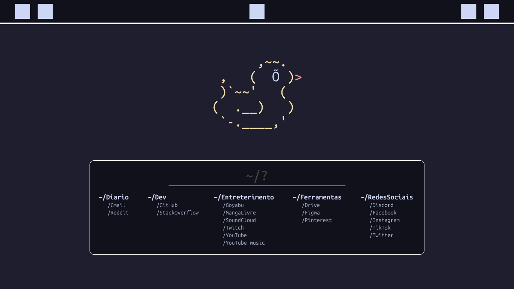</th>
  </tr>
</table>

Paginas

<table>
  <tr>
    <th>Tela de descanso</th>
  </tr>
  <tr>
    <th></img></th>
  </tr>
</table>
<table>
  <tr>
    <th>Marcadores</th>
  </tr>
  <tr>
    <th></img></th>
  </tr>
</table>
<table>
  <tr>
    <th>em trabalho</th>
  </tr>
  <tr>
    <th>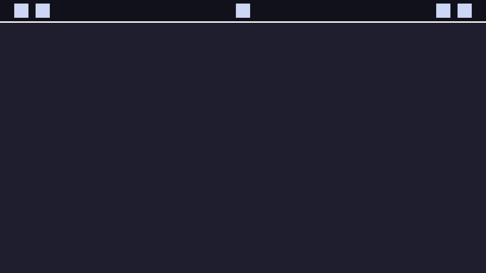</img></th>
  </tr>
</table>

&nbsp;

### Funcionalidades

Mussum Ipsum, cacilds vidis litro abertis. Paisis, filhis, espiritis santis.Interagi no mé, cursus quis, vehicula ac nisi.

Marcador

* botão para adicionar
* a

&nbsp;

### Tema <a href="https://github.com/catppuccin">Catppuccin</a>

Catppuccin é uma paleta de cores pasteis. Dentre as 4 paletas a escolhida para o projeto foi a Mocha.

 Mocha palette

&nbsp;

Catppuccin infrastructure: <strong> Base > Mantle > Crust </strong>

<table>
  <tr>
  <th></th>
  <th>Labels</th>
  <th>Hex</th>
  <th></th>
  <th></th>
  <th>Labels</th>
  <th>Hex</th>
 </tr>

 <tr>
  <td>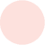</td>
  <td>Rosewater</td>
  <td><code>#f5e0dc</code></td>
  <td></td>
  <td></td>
  <td>Text</td>
  <td><code>#cdd6f4</code></td>
 </tr>

 <tr>
  <td>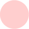</td>
  <td>Flamingo</td>
  <td><code>#f2cdcd</code></td>
  <td></td>
  <td>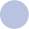</td>
  <td>Subtext1</td>
  <td><code>#bac2de</code></td>
 </tr>

 <tr>
  <td>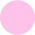</td>
  <td>Pink</td>
  <td><code>#f5c2e7</code></td>
  <td></td>
  <td></td>
  <td>Subtext0</td>
  <td><code>#a6adc8</code></td>
 </tr>

 <tr>
  <td>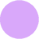</td>
  <td>Mauve</td>
  <td><code>#cba6f7</code></td>
  <td></td>
  <td></td>
  <td>Overlay2</td>
  <td><code>#9399b2</code></td>
 </tr>

 <tr>
  <td>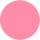</td>
  <td>Red</td>
  <td><code>#f38ba8</code></td>
  <td></td>
  <td>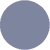</td>
  <td>Overlay1</td>
  <td><code>#7f849c</code></td>
 </tr>

 <tr>
  <td></td>
  <td>Maroon</td>
  <td><code>#eba0ac</code></td>
  <td></td>
  <td></td>
  <td>Overlay0</td>
  <td><code>#6c7086</code></td>
 </tr>

 <tr>
  <td>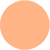</td>
  <td>Peach</td>
  <td><code>#fab387</code></td>
  <td></td>
  <td></td>
  <td>Surface2</td>
  <td><code>#585b70</code></td>
 </tr>

 <tr>
  <td>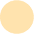</td>
  <td>Yellow</td>
  <td><code>#f9e2af</code></td>
  <td></td>
  <td></td>
  <td>Surface1</td>
  <td><code>#45475a</code></td>
 </tr>

 <tr>
  <td>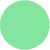</td>
  <td>Green</td>
  <td><code>#a6e3a1</code></td>
  <td></td>
  <td></td>
  <td>Surface0</td>
  <td><code>#313244</code></td>
 </tr>

 <tr>
  <td></td>
  <td>Teal</td>
  <td><code>#313244</code></td>
  <td></td>
  <td></td>
  <td>Base</td>
  <td><code>#1e1e2e</code></td>
 </tr>

 <tr>
  <td>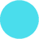</td>
  <td>Sky</td>
  <td><code>#89dceb</code></td>
  <td></td>
  <td></td>
  <td>Mantle</td>
  <td><code>#181825</code></td>
 </tr>

 <tr>
  <td></td>
  <td>Sapphire</td>
  <td><code>#74c7ec</code></td>
  <td></td>
  <td></td>
  <td>Crust</td>
  <td><code>#11111b</code></td>
 </tr>

 <tr>
  <td></td>
  <td>Blue</td>
  <td><code>#89b4fa</code></td>
  <td></td>
  <td></td>
  <td></td>
  <td></td>
 </tr>

 <tr>
  <td>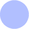</td>
  <td>Lavender</td>
  <td><code>#b4befe</code></td>
  <td></td>
  <td></td>
  <td></td>
  <td></td>
</table>

&nbsp;

### Roadmap

algumas funcionalidades nao estão funcionamento ou inseridos, aqui iremos detalhar os próximos passos.

Hora

* em trabalho

Clima

* em trabalho

Buscador

* em trabalho

Script

* em trabalho

&nbsp;

### Sub-sub-sub-titulo

Mussum Ipsum, cacilds vidis litro abertis. Si u mundo tá muito paradis? Toma um mé que o mundo vai girarzis!Aenean aliquam molestie leo, vitae iaculis nisl.In elementis mé pra quem é amistosis quis leo.Casamentiss faiz malandris se pirulitá.

&nbsp;

### Comunidade StartPage

