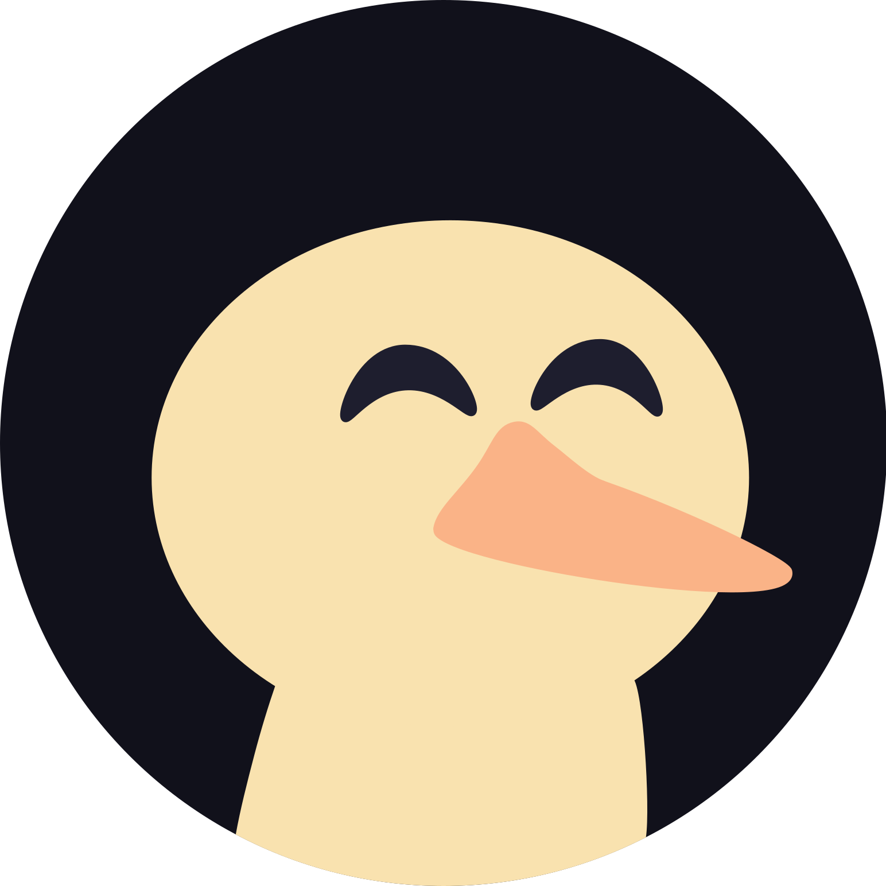

<!--Start Page personalizada-->
<div align="center">
<h3> 

Duck home
</h3>

Duck home tem como finalidade ser leve, agradável, funcional e o centro durante o uso do navegador com suas funcionalidades.
</div>

&nbsp;

### Preview

| Tela de descanso                                      | Marcadores                                         |
| ----------------------------------------------------- | -------------------------------------------------- |
|  |  |

<details><summary>Paginas</summary>

|                                                              |
| ------------------------------------------------------------ |
| Tela de descanso                                             |
|         |
| Marcadores                                                   |
|           |
| Tela segundaria                                              |
|  |
</details>

&nbsp;

### Funcionalidades

Mussum Ipsum, cacilds vidis litro abertis. Paisis, filhis, espiritis santis.Interagi no mé, cursus quis, vehicula ac nisi.

<details><summary>Marcador</summary>

- em trabalho

</details>

<details><summary>Hora</summary>

- em trabalho

</details>

<details><summary>Clima</summary>

- em trabalho

</details>

<details><summary>Buscador</summary>

- em trabalho

</details>

&nbsp;

### Tema <a href="https://github.com/catppuccin">Catppuccin</a>

Catppuccin é uma paleta de cores pasteis. Dentre as 4 paletas a escolhida para o projeto foi a Mocha.

<details><summary> Mocha palette</summary>

&nbsp;

Catppuccin infrastructure: **Base > Mantle > Crust**

| Cor                                                     | Rótulo     | Hex           |        | Cor                                                  | Rótulo             | Hex           |
| ------------------------------------------------------- | ---------- | ------------- | ------ | ---------------------------------------------------- | ------------------ | ------------- |
|    | Rosewater  | ```#f5e0dc``` |        |      | Text               | ```#cdd6f4``` |
|     | Flamingo   | ```#f2cdcd``` |        |  | Subtext1           | ```#bac2de``` |
|         | Pink       | ```#f5c2e7``` |        |  | Subtext0           | ```#a6adc8``` |
|        | Mauve      | ```#cba6f7``` |        |  | Overlay2           | ```#9399b2``` |
|          | Red        | ```#f38ba8``` |        |  | Overlay1           | ```#7f849c``` |
|       | Maroon     | ```#eba0ac``` |        |  | Overlay0           | ```#6c7086``` |
|        | Peach      | ```#fab387``` |        |  | Surface2           | ```#585b70``` |
|       | Yellow     | ```#f9e2af``` |        |  | Surface1           | ```#45475a``` |
|        | Green      | ```#a6e3a1``` |        |  | Surface0           | ```#313244``` |
|         | Teal       | ```#313244``` |        |      | Base               | ```#1e1e2e``` |
|          | Sky        | ```#89dceb``` |        |    | Mantle             | ```#181825``` |
|     | Sapphire   | ```#74c7ec``` |        |     | Crust              | ```#11111b``` |
|         | Blue       | ```#89b4fa``` |        |                                                      |                    |               |
|     | Lavender   | ```#b4befe``` |        |                                                      |                    |               |
</details>

&nbsp;

### Roadmap

Algumas funcionalidades não estão em funcionamento ou adicionadas.

<details><summary>Script</summary>

- em trabalho

</details>

&nbsp;

<div align="center">

### Comunidade StartPage

<a href="https://reddit.com/r/startpages"></a>
</div>
